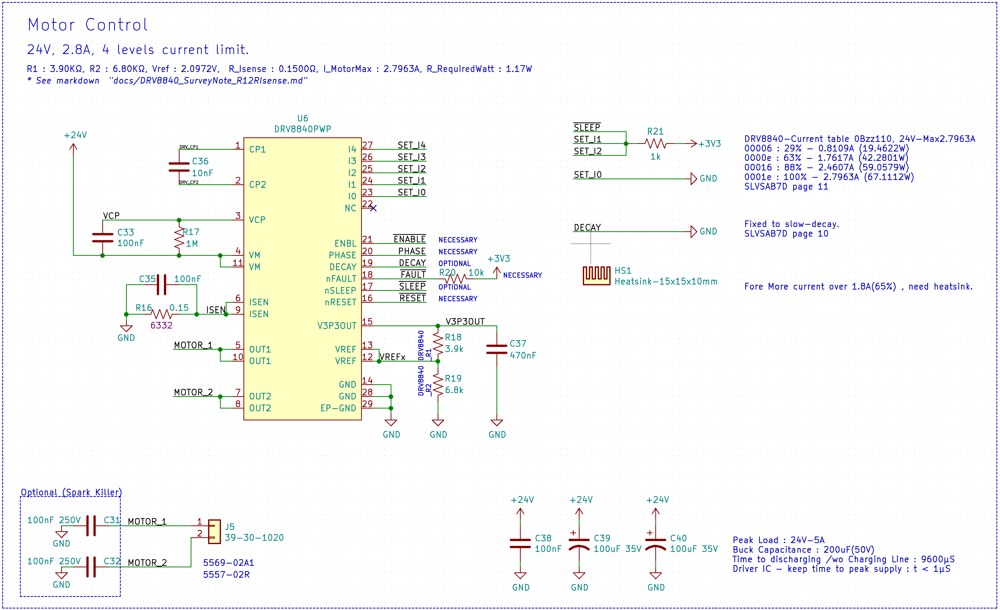

# DRV8840-CircuitSurvey
Examples of use with Python in embedded circuit design. (DRV8840)

This document forked from [DRV8840_SurveyNote_R12RIsense.md](DRV8840_SurveyNote_R12RIsense.md).

pmnxis@gmail.com (Jinwoo Park)  2020-09-06


# Purpose of this example (이 예시의 목적)

[DRV8840_Schematic.pdf](DRV8840_Schematic.pdf)

KOR : 
```
DRV8840은 모터구동을 위한 Driver IC이며 R1과 R2, R_ISense (회로도상에서 R18,R19,R16) 의 조정을 통해 최대 전류량을 설정할 수 있다. 하지만 저항은 내가 딱 원하는 저항값을 구할 수 없으며 R_ISense 같은 경우 전류 센싱 저항이므로 최대수용가능한 전류량(Watt)가 있다. 
본 예시는 원하는 전류량을 시장에서 판매하고있는 저항값 테이블내에서 적합한 조합을 도출한다. 이와 같은 방법은 몬테카를로 방법이라고 통용되기도 한다.
```
ENG :
``` 
The DRV8840 is a driver IC for motor operation and can be set up by adjusting R1 and R2, R_ISense (R18, R19, R16 on circuits). However, the resistance is not exactly what I want, and in the case of R_ISense, it is a current sensing resistance, so there is a maximum acceptable current amount (Watt). 
This example derives an appropriate combination within the resistance value table that is selling the desired current volume in the market. This method is sometimes referred to as the Monte Carlo method.
```

## Conclusion
R1 : 3.90KΩ, R2 : 6.80KΩ, Vref : 2.0972V

R_Isense : 0.1500Ω, I_MotorMax : 2.7963A, R_RequiredWatt : 1.17W

R1 : 3.9kΩ 1608(0603)

R2 : 6.8kΩ 1608(0603)

R_ISense : 0.15Ω 2W

Maximum Current with this profile : 2.7963A


## Python Code Filtered Table.
```
0402 combine
R1 : 2.20KΩ, R2 : 3.90KΩ, Vref : 2.1098V	 R_Isense : 0.1500Ω, I_MotorMax : 2.8131A, R_RequiredWatt : 1.19W
R1 : 6.80KΩ, R2 : 12.00KΩ, Vref : 2.1064V	 R_Isense : 0.1500Ω, I_MotorMax : 2.8085A, R_RequiredWatt : 1.18W
R1 : 6.80KΩ, R2 : 12.00KΩ, Vref : 2.1064V	 R_Isense : 0.1500Ω, I_MotorMax : 2.8085A, R_RequiredWatt : 1.18W
R1 : 3.90KΩ, R2 : 6.80KΩ, Vref : 2.0972V	 R_Isense : 0.1500Ω, I_MotorMax : 2.7963A, R_RequiredWatt : 1.17W
R1 : 3.00KΩ, R2 : 5.10KΩ, Vref : 2.0778V	 R_Isense : 0.1500Ω, I_MotorMax : 2.7704A, R_RequiredWatt : 1.15W
R1 : 12.00KΩ, R2 : 20.00KΩ, Vref : 2.0625V	 R_Isense : 0.1500Ω, I_MotorMax : 2.7500A, R_RequiredWatt : 1.13W
R1 : 12.00KΩ, R2 : 20.00KΩ, Vref : 2.0625V	 R_Isense : 0.1500Ω, I_MotorMax : 2.7500A, R_RequiredWatt : 1.13W
R1 : 2.00KΩ, R2 : 3.30KΩ, Vref : 2.0547V	 R_Isense : 0.1500Ω, I_MotorMax : 2.7396A, R_RequiredWatt : 1.13W
R1 : 5.10KΩ, R2 : 8.20KΩ, Vref : 2.0346V	 R_Isense : 0.1500Ω, I_MotorMax : 2.7128A, R_RequiredWatt : 1.10W
R1 : 3.30KΩ, R2 : 5.10KΩ, Vref : 2.0036V	 R_Isense : 0.1500Ω, I_MotorMax : 2.6714A, R_RequiredWatt : 1.07W
R1 : 2.00KΩ, R2 : 3.00KΩ, Vref : 1.9800V	 R_Isense : 0.1500Ω, I_MotorMax : 2.6400A, R_RequiredWatt : 1.05W
R1 : 2.20KΩ, R2 : 3.30KΩ, Vref : 1.9800V	 R_Isense : 0.1500Ω, I_MotorMax : 2.6400A, R_RequiredWatt : 1.05W
R1 : 10.00KΩ, R2 : 15.00KΩ, Vref : 1.9800V	 R_Isense : 0.1500Ω, I_MotorMax : 2.6400A, R_RequiredWatt : 1.05W
R1 : 10.00KΩ, R2 : 15.00KΩ, Vref : 1.9800V	 R_Isense : 0.1500Ω, I_MotorMax : 2.6400A, R_RequiredWatt : 1.05W
R1 : 12.00KΩ, R2 : 18.00KΩ, Vref : 1.9800V	 R_Isense : 0.1500Ω, I_MotorMax : 2.6400A, R_RequiredWatt : 1.05W
R1 : 12.00KΩ, R2 : 18.00KΩ, Vref : 1.9800V	 R_Isense : 0.1500Ω, I_MotorMax : 2.6400A, R_RequiredWatt : 1.05W
R1 : 6.80KΩ, R2 : 10.00KΩ, Vref : 1.9643V	 R_Isense : 0.1500Ω, I_MotorMax : 2.6190A, R_RequiredWatt : 1.03W
R1 : 8.20KΩ, R2 : 12.00KΩ, Vref : 1.9604V	 R_Isense : 0.1500Ω, I_MotorMax : 2.6139A, R_RequiredWatt : 1.02W
R1 : 8.20KΩ, R2 : 12.00KΩ, Vref : 1.9604V	 R_Isense : 0.1500Ω, I_MotorMax : 2.6139A, R_RequiredWatt : 1.02W
R1 : 5.10KΩ, R2 : 12.00KΩ, Vref : 2.3158V	 R_Isense : 0.1800Ω, I_MotorMax : 2.5731A, R_RequiredWatt : 1.19W
R1 : 5.10KΩ, R2 : 12.00KΩ, Vref : 2.3158V	 R_Isense : 0.1800Ω, I_MotorMax : 2.5731A, R_RequiredWatt : 1.19W
R1 : 2.20KΩ, R2 : 5.10KΩ, Vref : 2.3055V	 R_Isense : 0.1800Ω, I_MotorMax : 2.5616A, R_RequiredWatt : 1.18W
R1 : 3.00KΩ, R2 : 6.80KΩ, Vref : 2.2898V	 R_Isense : 0.1800Ω, I_MotorMax : 2.5442A, R_RequiredWatt : 1.17W
R1 : 2.20KΩ, R2 : 3.00KΩ, Vref : 1.9038V	 R_Isense : 0.1500Ω, I_MotorMax : 2.5385A, R_RequiredWatt : 0.97W
R1 : 6.80KΩ, R2 : 15.00KΩ, Vref : 2.2706V	 R_Isense : 0.1800Ω, I_MotorMax : 2.5229A, R_RequiredWatt : 1.15W
R1 : 6.80KΩ, R2 : 15.00KΩ, Vref : 2.2706V	 R_Isense : 0.1800Ω, I_MotorMax : 2.5229A, R_RequiredWatt : 1.15W
R1 : 1.00KΩ, R2 : 2.20KΩ, Vref : 2.2687V	 R_Isense : 0.1800Ω, I_MotorMax : 2.5208A, R_RequiredWatt : 1.14W
R1 : 8.20KΩ, R2 : 18.00KΩ, Vref : 2.2672V	 R_Isense : 0.1800Ω, I_MotorMax : 2.5191A, R_RequiredWatt : 1.14W
R1 : 5.10KΩ, R2 : 6.80KΩ, Vref : 1.8857V	 R_Isense : 0.1500Ω, I_MotorMax : 2.5143A, R_RequiredWatt : 0.95W
R1 : 15.00KΩ, R2 : 20.00KΩ, Vref : 1.8857V	 R_Isense : 0.1500Ω, I_MotorMax : 2.5143A, R_RequiredWatt : 0.95W
R1 : 15.00KΩ, R2 : 20.00KΩ, Vref : 1.8857V	 R_Isense : 0.1500Ω, I_MotorMax : 2.5143A, R_RequiredWatt : 0.95W

0603 combine
R1 : 6.20KΩ, R2 : 4.99KΩ, Vref : 1.4716V	 R_Isense : 0.1000Ω, I_MotorMax : 2.9432A, R_RequiredWatt : 0.87W
R1 : 15.00KΩ, R2 : 12.00KΩ, Vref : 1.4667V	 R_Isense : 0.1000Ω, I_MotorMax : 2.9333A, R_RequiredWatt : 0.86W
R1 : 2.40KΩ, R2 : 4.30KΩ, Vref : 2.1179V	 R_Isense : 0.1500Ω, I_MotorMax : 2.8239A, R_RequiredWatt : 1.20W
R1 : 6.20KΩ, R2 : 11.00KΩ, Vref : 2.1105V	 R_Isense : 0.1500Ω, I_MotorMax : 2.8140A, R_RequiredWatt : 1.19W
R1 : 2.20KΩ, R2 : 3.90KΩ, Vref : 2.1098V	 R_Isense : 0.1500Ω, I_MotorMax : 2.8131A, R_RequiredWatt : 1.19W
R1 : 9.10KΩ, R2 : 16.00KΩ, Vref : 2.1036V	 R_Isense : 0.1500Ω, I_MotorMax : 2.8048A, R_RequiredWatt : 1.18W
R1 : 3.90KΩ, R2 : 6.80KΩ, Vref : 2.0972V	 R_Isense : 0.1500Ω, I_MotorMax : 2.7963A, R_RequiredWatt : 1.17W
R1 : 2.70KΩ, R2 : 4.70KΩ, Vref : 2.0959V	 R_Isense : 0.1500Ω, I_MotorMax : 2.7946A, R_RequiredWatt : 1.17W
R1 : 7.50KΩ, R2 : 13.00KΩ, Vref : 2.0927V	 R_Isense : 0.1500Ω, I_MotorMax : 2.7902A, R_RequiredWatt : 1.17W
R1 : 3.30KΩ, R2 : 5.60KΩ, Vref : 2.0764V	 R_Isense : 0.1500Ω, I_MotorMax : 2.7685A, R_RequiredWatt : 1.15W
R1 : 1.20KΩ, R2 : 2.00KΩ, Vref : 2.0625V	 R_Isense : 0.1500Ω, I_MotorMax : 2.7500A, R_RequiredWatt : 1.13W
R1 : 2.20KΩ, R2 : 3.60KΩ, Vref : 2.0483V	 R_Isense : 0.1500Ω, I_MotorMax : 2.7310A, R_RequiredWatt : 1.12W
R1 : 5.60KΩ, R2 : 9.10KΩ, Vref : 2.0429V	 R_Isense : 0.1500Ω, I_MotorMax : 2.7238A, R_RequiredWatt : 1.11W
R1 : 6.80KΩ, R2 : 11.00KΩ, Vref : 2.0393V	 R_Isense : 0.1500Ω, I_MotorMax : 2.7191A, R_RequiredWatt : 1.11W
R1 : 10.00KΩ, R2 : 16.00KΩ, Vref : 2.0308V	 R_Isense : 0.1500Ω, I_MotorMax : 2.7077A, R_RequiredWatt : 1.10W
R1 : 1.50KΩ, R2 : 2.40KΩ, Vref : 2.0308V	 R_Isense : 0.1500Ω, I_MotorMax : 2.7077A, R_RequiredWatt : 1.10W
R1 : 2.70KΩ, R2 : 4.30KΩ, Vref : 2.0271V	 R_Isense : 0.1500Ω, I_MotorMax : 2.7029A, R_RequiredWatt : 1.10W
R1 : 3.90KΩ, R2 : 6.20KΩ, Vref : 2.0257V	 R_Isense : 0.1500Ω, I_MotorMax : 2.7010A, R_RequiredWatt : 1.09W
R1 : 8.20KΩ, R2 : 13.00KΩ, Vref : 2.0236V	 R_Isense : 0.1500Ω, I_MotorMax : 2.6981A, R_RequiredWatt : 1.09W
R1 : 3.30KΩ, R2 : 5.10KΩ, Vref : 2.0036V	 R_Isense : 0.1500Ω, I_MotorMax : 2.6714A, R_RequiredWatt : 1.07W
R1 : 3.30KΩ, R2 : 4.99KΩ, Vref : 1.9864V	 R_Isense : 0.1500Ω, I_MotorMax : 2.6485A, R_RequiredWatt : 1.05W
R1 : 1.20KΩ, R2 : 1.80KΩ, Vref : 1.9800V	 R_Isense : 0.1500Ω, I_MotorMax : 2.6400A, R_RequiredWatt : 1.05W
R1 : 2.20KΩ, R2 : 3.30KΩ, Vref : 1.9800V	 R_Isense : 0.1500Ω, I_MotorMax : 2.6400A, R_RequiredWatt : 1.05W
R1 : 1.00KΩ, R2 : 1.50KΩ, Vref : 1.9800V	 R_Isense : 0.1500Ω, I_MotorMax : 2.6400A, R_RequiredWatt : 1.05W
R1 : 10.00KΩ, R2 : 15.00KΩ, Vref : 1.9800V	 R_Isense : 0.1500Ω, I_MotorMax : 2.6400A, R_RequiredWatt : 1.05W
R1 : 12.00KΩ, R2 : 18.00KΩ, Vref : 1.9800V	 R_Isense : 0.1500Ω, I_MotorMax : 2.6400A, R_RequiredWatt : 1.05W
R1 : 2.40KΩ, R2 : 3.60KΩ, Vref : 1.9800V	 R_Isense : 0.1500Ω, I_MotorMax : 2.6400A, R_RequiredWatt : 1.05W
R1 : 6.20KΩ, R2 : 9.10KΩ, Vref : 1.9627V	 R_Isense : 0.1500Ω, I_MotorMax : 2.6170A, R_RequiredWatt : 1.03W
R1 : 7.50KΩ, R2 : 11.00KΩ, Vref : 1.9622V	 R_Isense : 0.1500Ω, I_MotorMax : 2.6162A, R_RequiredWatt : 1.03W
R1 : 5.60KΩ, R2 : 8.20KΩ, Vref : 1.9609V	 R_Isense : 0.1500Ω, I_MotorMax : 2.6145A, R_RequiredWatt : 1.03W
R1 : 11.00KΩ, R2 : 16.00KΩ, Vref : 1.9556V	 R_Isense : 0.1500Ω, I_MotorMax : 2.6074A, R_RequiredWatt : 1.02W
R1 : 2.70KΩ, R2 : 3.90KΩ, Vref : 1.9500V	 R_Isense : 0.1500Ω, I_MotorMax : 2.6000A, R_RequiredWatt : 1.01W
R1 : 3.30KΩ, R2 : 4.70KΩ, Vref : 1.9387V	 R_Isense : 0.1500Ω, I_MotorMax : 2.5850A, R_RequiredWatt : 1.00W
R1 : 6.80KΩ, R2 : 16.00KΩ, Vref : 2.3158V	 R_Isense : 0.1800Ω, I_MotorMax : 2.5731A, R_RequiredWatt : 1.19W
R1 : 2.00KΩ, R2 : 4.70KΩ, Vref : 2.3149V	 R_Isense : 0.1800Ω, I_MotorMax : 2.5721A, R_RequiredWatt : 1.19W
R1 : 4.70KΩ, R2 : 11.00KΩ, Vref : 2.3121V	 R_Isense : 0.1800Ω, I_MotorMax : 2.5690A, R_RequiredWatt : 1.19W
R1 : 3.90KΩ, R2 : 9.10KΩ, Vref : 2.3100V	 R_Isense : 0.1800Ω, I_MotorMax : 2.5667A, R_RequiredWatt : 1.19W
R1 : 5.60KΩ, R2 : 13.00KΩ, Vref : 2.3065V	 R_Isense : 0.1800Ω, I_MotorMax : 2.5627A, R_RequiredWatt : 1.18W
R1 : 2.20KΩ, R2 : 5.10KΩ, Vref : 2.3055V	 R_Isense : 0.1800Ω, I_MotorMax : 2.5616A, R_RequiredWatt : 1.18W
R1 : 3.60KΩ, R2 : 4.99KΩ, Vref : 1.9170V	 R_Isense : 0.1500Ω, I_MotorMax : 2.5560A, R_RequiredWatt : 0.98W
R1 : 2.70KΩ, R2 : 6.20KΩ, Vref : 2.2989V	 R_Isense : 0.1800Ω, I_MotorMax : 2.5543A, R_RequiredWatt : 1.17W
R1 : 3.30KΩ, R2 : 7.50KΩ, Vref : 2.2917V	 R_Isense : 0.1800Ω, I_MotorMax : 2.5463A, R_RequiredWatt : 1.17W
R1 : 2.20KΩ, R2 : 4.99KΩ, Vref : 2.2903V	 R_Isense : 0.1800Ω, I_MotorMax : 2.5447A, R_RequiredWatt : 1.17W
R1 : 1.20KΩ, R2 : 2.70KΩ, Vref : 2.2846V	 R_Isense : 0.1800Ω, I_MotorMax : 2.5385A, R_RequiredWatt : 1.16W
R1 : 8.20KΩ, R2 : 11.00KΩ, Vref : 1.8906V	 R_Isense : 0.1500Ω, I_MotorMax : 2.5208A, R_RequiredWatt : 0.95W
R1 : 8.20KΩ, R2 : 18.00KΩ, Vref : 2.2672V	 R_Isense : 0.1800Ω, I_MotorMax : 2.5191A, R_RequiredWatt : 1.14W
R1 : 5.60KΩ, R2 : 7.50KΩ, Vref : 1.8893V	 R_Isense : 0.1500Ω, I_MotorMax : 2.5191A, R_RequiredWatt : 0.95W
R1 : 6.80KΩ, R2 : 9.10KΩ, Vref : 1.8887V	 R_Isense : 0.1500Ω, I_MotorMax : 2.5182A, R_RequiredWatt : 0.95W
R1 : 2.70KΩ, R2 : 3.60KΩ, Vref : 1.8857V	 R_Isense : 0.1500Ω, I_MotorMax : 2.5143A, R_RequiredWatt : 0.95W
R1 : 12.00KΩ, R2 : 16.00KΩ, Vref : 1.8857V	 R_Isense : 0.1500Ω, I_MotorMax : 2.5143A, R_RequiredWatt : 0.95W
R1 : 1.50KΩ, R2 : 2.00KΩ, Vref : 1.8857V	 R_Isense : 0.1500Ω, I_MotorMax : 2.5143A, R_RequiredWatt : 0.95W
R1 : 5.10KΩ, R2 : 11.00KΩ, Vref : 2.2547V	 R_Isense : 0.1800Ω, I_MotorMax : 2.5052A, R_RequiredWatt : 1.13W
R1 : 4.70KΩ, R2 : 6.20KΩ, Vref : 1.8771V	 R_Isense : 0.1500Ω, I_MotorMax : 2.5028A, R_RequiredWatt : 0.94W
R1 : 2.00KΩ, R2 : 4.30KΩ, Vref : 2.2524V	 R_Isense : 0.1800Ω, I_MotorMax : 2.5026A, R_RequiredWatt : 1.13W
R1 : 5.60KΩ, R2 : 12.00KΩ, Vref : 2.2500V	 R_Isense : 0.1800Ω, I_MotorMax : 2.5000A, R_RequiredWatt : 1.13W
DRV8840-Current table 0b ZZ  7
00007 : 34% - 0.9507A (22.8178W)
0000f : 67% - 1.8735A (44.9645W)
00017 : 90% - 2.5167A (60.4001W)
0001f : 100% - 2.7963A (67.1112W)


DRV8840-Current table 0b ZZ  6
00006 : 29% - 0.8109A (19.4622W)
0000e : 63% - 1.7617A (42.2801W)
00016 : 88% - 2.4607A (59.0579W)
0001e : 100% - 2.7963A (67.1112W)


DRV8840-Current table 0b ZZ  5
00005 : 24% - 0.6711A (16.1067W)
0000d : 60% - 1.6778A (40.2667W)
00015 : 86% - 2.4048A (57.7156W)
0001d : 99% - 2.7683A (66.4401W)


DRV8840-Current table 0b ZZ  4
00004 : 20% - 0.5593A (13.4222W)
0000c : 56% - 1.5659A (37.5823W)
00014 : 83% - 2.3209A (55.7023W)
0001c : 98% - 2.7404A (65.7690W)
```


### Python Code
```python
import sys
import math

chipres = [3300, 100000, 47000, 10000, 2000, 5100, 10, 1000, 22, 15000, 20000, 470, 47000, 2200, 100, 1000000, 15000, 33, 12000, 510, 51000, 33000, 330, 200000, 220, 22000, 3000000, 12000, 39000, 49.9, 510000, 680, 75000, 1.0, 8200, 150, 200, 24000, 51, 6800, 120000, 470000, 220000, 3900, 49900, 27000, 68000, 75000, 24000, 3000, 330000, 56000, 150000, 18000, 10000000, 120]
cschipres = [0.025, 0.033, 0.045, 0.051, 0.075, 0.08, 0.1, 0.15, 0.18, 0.2, 0.30, 0.35, 0.4, 0.45]
rlist0603 = [ \
    330, 10, 10, 120, 1200, 220, 2200, 220000, 510, \
    75, 1000, 10000, 120000, 15000, 200, 2700, 33, 3300, \
    47, 5600, 12000, 30000, 7500, 39000, 470, 49.9, 49900, \
    560, 56000, 1500, 2000, 8200, 150, 150000, 20, 3900, \
    370000, 51, 24000, 300000, 33000, 100, 100000, 680, 6800, \
    68000, 75000, 27000, 300, 4700, 47000, 51000, 18000, 200000, \
    22, 2400, 270, 330000, 13000, 1800, 390, 2000000, 43000, 6200, \
    820, 9100, 5100, 82000, 2.2, 3600, 4.7, 40200, 510000, 1.0, \
    11000, 240000, 110000, 180000, 62000, 180, 2.0, 4990, 560000, 1100, \
    82, 270000, 68, 750, 15, 160000, 91000, 1500000, 16000, 2.2, \
    36000, 4700000, 56, 620, 680000, 240, 27, 3000000, 360, 390000, \
    4300, 130000, 110, 130, 160, 24, 430, 5100000, 1200000, 360000, \
    430000, 910, 750000, 620000, 91 ]
chipres.sort()

#   MS122WF100LT4E, C63324, LOW RESISTORS & CURRENT SENSE RESISTORS - SURFACE MOUNT 0.1OHMS ±1% 2W 2512 ROHS
#   MRF6432(2512)LR400FTS, C76262, LOW RESISTORS & CURRENT SENSE RESISTORS - SURFACE MOUNT 0.4OHMS ±1% 2W 2512 ROHS
#   MRF6432(2512)LR180FTS, C76257, LOW RESISTORS & CURRENT SENSE RESISTORS - SURFACE MOUNT 0.18OHMS ±1% 2W 2512 ROHS
#   MRF6432(2512)LR400FTS, C76262, LOW RESISTORS & CURRENT SENSE RESISTORS - SURFACE MOUNT 0.4OHMS ±1% 2W 2512 ROHS
#   MS123WF750MT4E, C78195, LOW RESISTORS & CURRENT SENSE RESISTORS - SURFACE MOUNT 0.075OHMS ±1% 3W 2512 ROHS
#   MRF6432(2512)LR033FTS, C76248, LOW RESISTORS & CURRENT SENSE RESISTORS - SURFACE MOUNT 0.033OHMS ±1% 2W 2512 ROHS
#   MRF6432(2512)LR150FTS, C76256, LOW RESISTORS & CURRENT SENSE RESISTORS - SURFACE MOUNT 0.15OHMS ±1% 2W 2512 ROHS
#   MRF6432(2512)LR012JTS, C76273, LOW RESISTORS & CURRENT SENSE RESISTORS - SURFACE MOUNT 0.012OHMS ±5% 2W 2512 ROHS

#   MS122WF450MT4E, 45mOhms 3W 2512

drv8840_chopping_table = [0, 5, 10, 15, 20, 24, 29, 34, 38, 43, 47, 51, 56, 60, 63, 67, 71, 74, 77, 80, 83, 86, 88, 90, 92, \
    94, 96, 97, 98, 99, 100, 100]

def filter_res(rlist, rmin, rmax):
    temp = []
    for i in range(len(rlist)):
        if(rlist[i] >= rmin and rlist[i] <= rmax):
            temp.append(rlist[i])
    return temp

def resnetdiv(vin, R1, R2):
    return (vin*R2)/(R1+R2)

def ichop(vrefx, Risense):
    return vrefx/(5.0*Risense)

def vichop(vin, R1, R2, Risense):
    return ichop(resnetdiv(vin, R1, R2), Risense)

def vkichop(vin, R1, R2, Risense):
    return ichop(resnetdiv(vin, R1*1000.0, R2*1000.0), Risense)

def maxRwatt(current, ohm):
    return (current*current*ohm)

def list_acceptable_voltage(vin, vout_min, vout_max, rlist):
    temp = []
    for i in range(len(rlist)):
        for j in range(i, len(rlist)):
            R1 = rlist[i]
            R2 = rlist[j]
            temp_vout = resnetdiv(vin, R1, R2)
            if(temp_vout >= vout_min and temp_vout <= vout_max):
                temp.append([R1, R2, temp_vout])
    return temp

def list_acceptable_ichop(rnet_list, csr_list, ichop_min, ichop_max, csr_watt_max):
    temp = []
    for i in range(len(csr_list)):
        for j in range(len(rnet_list)):
            Risense = csr_list[i]
            vrefx = rnet_list[j][2]
            temp_ichop = ichop(vrefx, Risense)
            temp_max_I = maxRwatt(temp_ichop, Risense)
            if(temp_ichop >= ichop_min and temp_ichop <= ichop_max and temp_max_I <= csr_watt_max):
                temp.append([rnet_list[j][0], rnet_list[j][1], rnet_list[j][2], Risense, temp_ichop, temp_max_I])

    return temp

def get_proper_drv8840_res(r12_min, r12_max, vref_min, vref_max, ichop_min, ichop_max, csr_watt_max, rlist, csrlist):
    filtered_res = filter_res(rlist, r12_min, r12_max)
    reduced_res_arr = list_acceptable_voltage(3.3, vref_min, vref_max, filtered_res)
    ichops_arr = list_acceptable_ichop(reduced_res_arr, csrlist, ichop_min, ichop_max, csr_watt_max)
    ichops_arr.sort(key=lambda x:x[4], reverse=True)
    for i in range(len(ichops_arr)):
        item = ichops_arr[i]
        R1 = item[0]
        R2 = item[1]
        Vref = item[2]
        Ris = item[3]
        Ic = item[4]
        maxWatt = item[5]
        str1 = 'R1 : %.02fKΩ, R2 : %.02fKΩ, Vref : %.04fV\t R_Isense : %.4fΩ, I_MotorMax : %.4fA, R_RequiredWatt : %.2fW' % (R1/1000, R2/1000, Vref, Ris, Ic, maxWatt) 
        print(str1)

def current_metering(voltage, max_current, bit_mask):
    print('DRV8840-Current table 0b ZZ ',bit_mask)
    for i in range(0, 4):
        idx = i*0b1000+bit_mask
        temp = drv8840_chopping_table[idx]
        current = max_current*(temp/100.0)
        str1 = '%05x : %d%% - %.4fA (%.4fW)' % (idx, temp, current, current*voltage)
        print(str1)
    print('\n')

print('0402 combine')
get_proper_drv8840_res(1000, 20000, 1.45, 3.0, 2.5, 2.95, 1.2, chipres, cschipres)
print('\n0603 combine')
get_proper_drv8840_res(1000, 20000, 1.45, 3.0, 2.5, 2.95, 1.2, rlist0603, cschipres)

current_metering(24.0, 2.7963, 0b111)
current_metering(24.0, 2.7963, 0b110)
current_metering(24.0, 2.7963, 0b101)
current_metering(24.0, 2.7963, 0b100)
```
